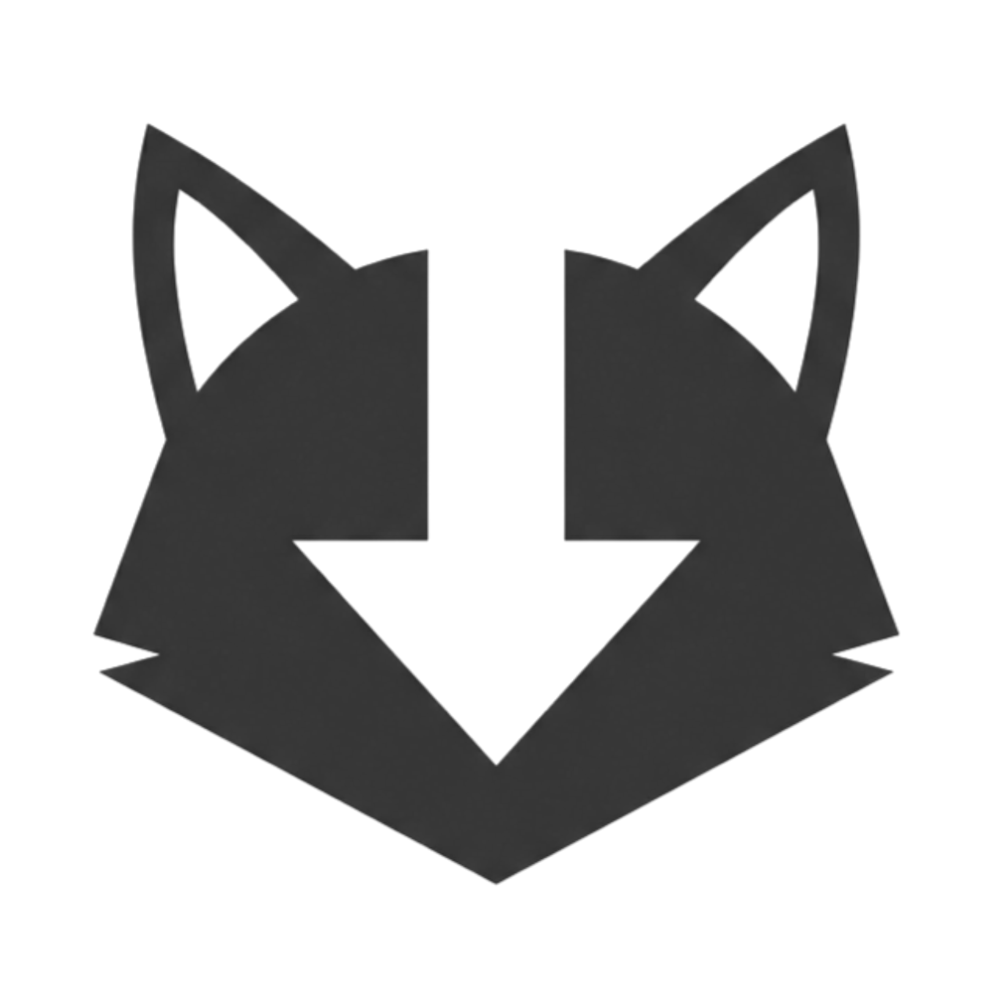

<div align="center">
  
  <h1>Candy</h1>
  <p>A modern, lightweight graphical user interface for yt-dlp built with WPF and .NET 8.0.</p>
</div>

---

## Overview

Candy is a standalone Windows frontend for `yt-dlp` and `FFmpeg`. It abstracts command-line operations into a seamless graphical interface, allowing users to parse, select, and download high-quality video and audio streams into standard media containers without requiring CLI knowledge.

## Features

- **Format Parsing**: Automatically fetches and categorizes all available video and audio streams for a given URL.
- **Custom Remuxing**: Combines high-resolution video tracks (e.g., 4K WebM) with separate audio tracks into standard `.mp4` or `.mkv` containers.
- **Native Fluent UI**: Built using Windows Presentation Foundation (WPF) with `WPF UI`, supporting native system themes (Light/Dark) and Mica backdrops on Windows 11.
- **Metadata Support**: Optional embedding of creator subtitles and stream metadata directly into the output file.

## Screenshots


## Installation

End-users can download the pre-compiled installer:

1. Navigate to the [Releases](../../releases) section of this repository.
2. Download `CandyInstaller.exe`.
3. Run the installer. All dependencies (including `yt-dlp` and `FFmpeg`) are bundled internally.

## Building from Source

To compile the application and its installer from source, you will need the [.NET 8.0 SDK](https://dotnet.microsoft.com/en-us/download) and [Inno Setup 6](https://jrsoftware.org/isdl.php).

### 1. Build the Executable

Clone the repository and run the following command in the project root to produce a standalone executable:

```cmd
dotnet publish -c Release -r win-x64 --self-contained true -p:PublishSingleFile=true -p:IncludeAllContentForSelfExtract=true
```

### 2. Supply External Binaries

Candy relies on external binaries that are **not** bundled in this source repository due to their size. Before compiling the Windows Installer, you must acquire these binaries manually:

1. Download the latest `yt-dlp.exe` from [yt-dlp releases](https://github.com/yt-dlp/yt-dlp/releases).
2. Download the latest `ffmpeg.exe` and `ffprobe.exe` from [FFmpeg Windows builds](https://ffmpeg.org/download.html).
3. Place all three `.exe` files into the following directory:
   `bin\Release\net8.0-windows\win-x64\publish\`

### 3. Compile the Installer

Open `setup.iss` with Inno Setup 6 and compile the script. The final installer will be generated as `CandyInstaller.exe` in the `Output\` directory.

## Acknowledgements

Candy is a graphical wrapper. All core downloading and media processing capabilities are strictly powered by the following incredible open-source projects. 

- **[yt-dlp](https://github.com/yt-dlp/yt-dlp)**: A youtube-dl fork with additional features and fixes.
- **[FFmpeg](https://ffmpeg.org/)**: A complete, cross-platform solution to record, convert and stream audio and video.
- **[WPF UI](https://github.com/lepoco/wpfui)**: Fluent design system elements for WPF.

## License

This project is licensed under the [MIT License](LICENSE).
